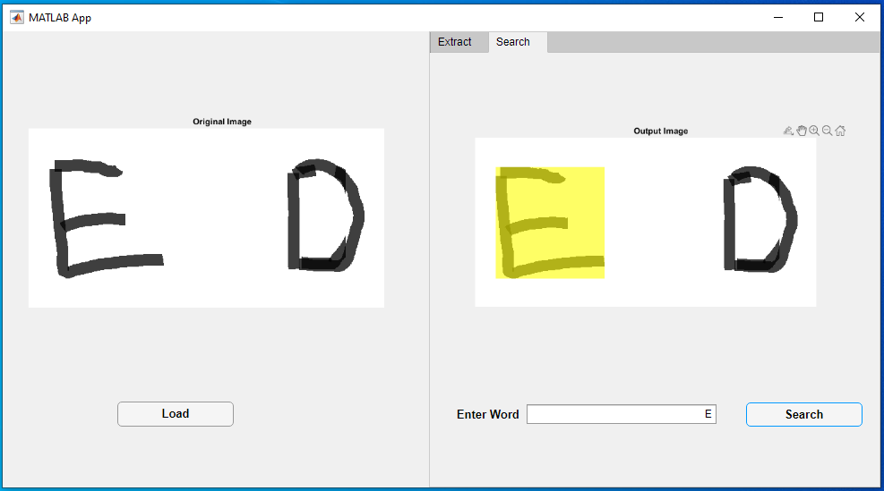
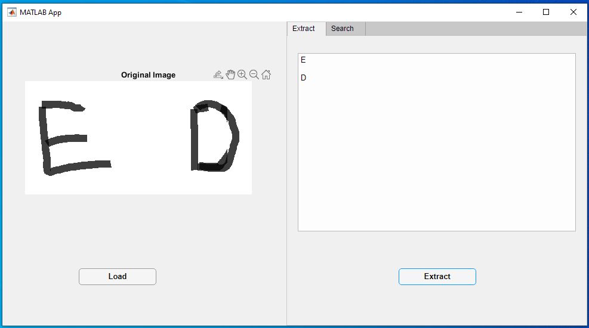
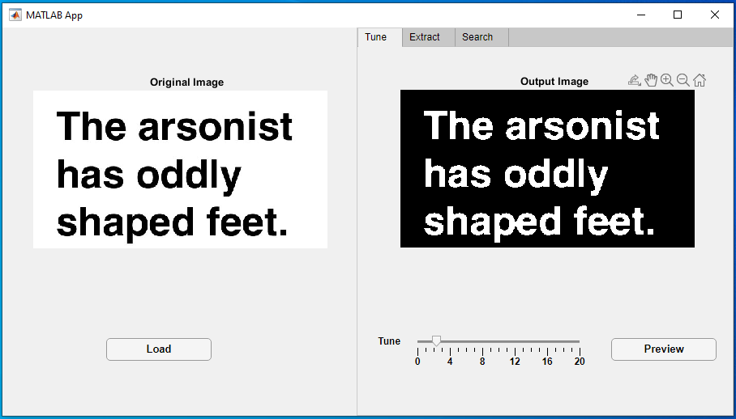
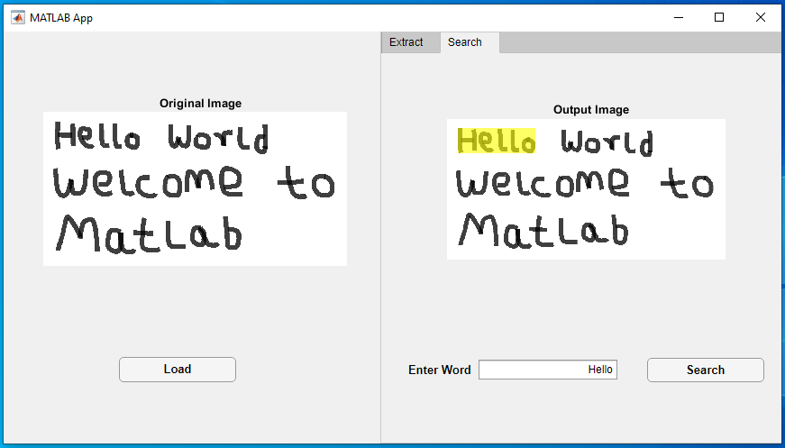
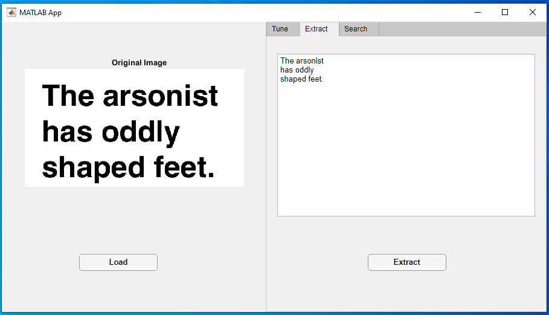

## **OCR App in MATLAB**

> Optical character recognition or optical character reader (OCR) is the electronic or mechanical conversion of images of typed, handwritten or printed text into machine-encoded text, whether from a scanned document, a photo of a document, a scene-photo (for example the text on signs and billboards in a landscape photo) or from subtitle text superimposed on an image (for example: from a television broadcast)

Source: _[Wikipedia](https://en.wikipedia.org/wiki/Optical_character_recognition)_

Below are screenshots of the app built with Mathwork's MATLAB. It makes use of the [computer vision toolbox](https://www.mathworks.com/products/computer-vision.html) and the [Image Processing Toolbox](https://www.mathworks.com/products/image.html)

## **ScreenShots**

- ### **Character Finder**

  

- ### **Character Extraction**

  

- ### **Input Tuning**

  

- ### **Word Finder**

  

- ### **Sentence Extraction**

  
